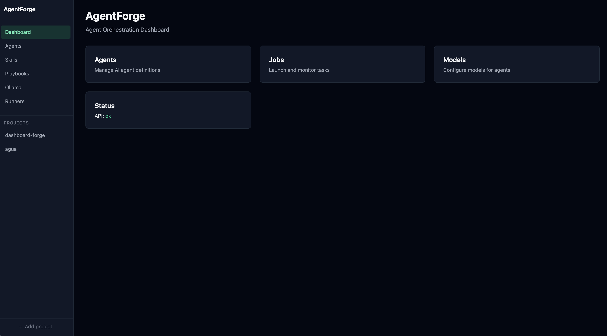
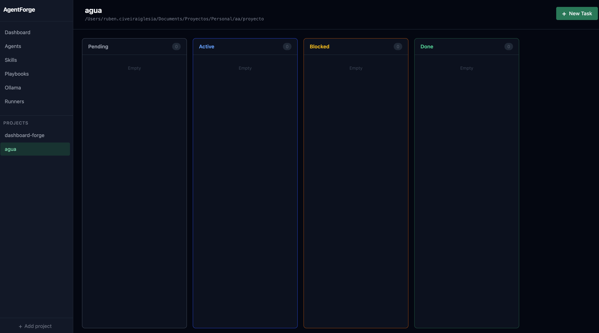
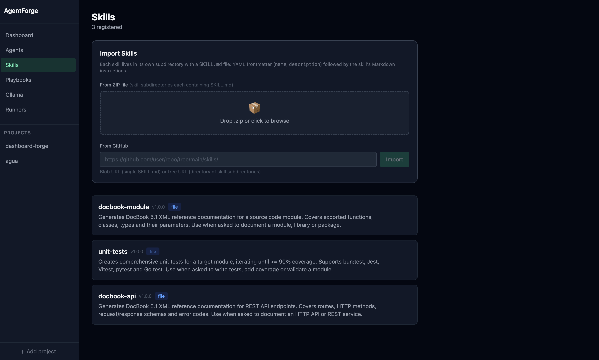
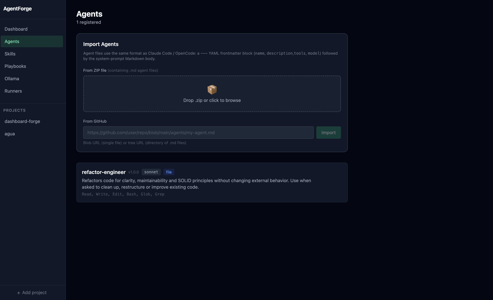
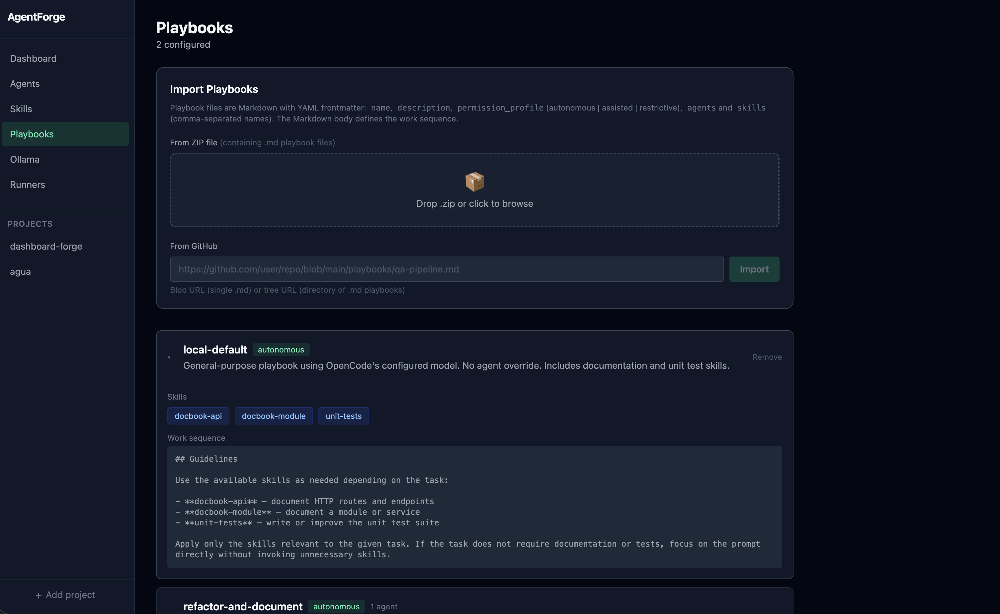
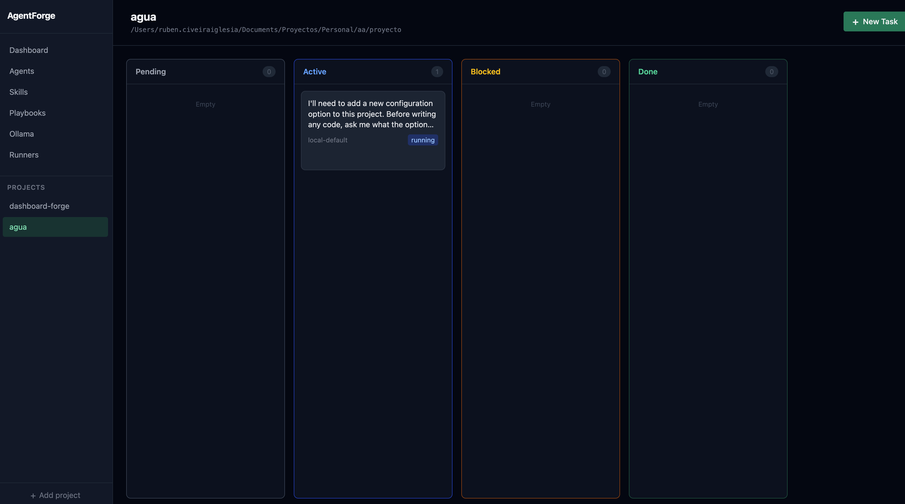
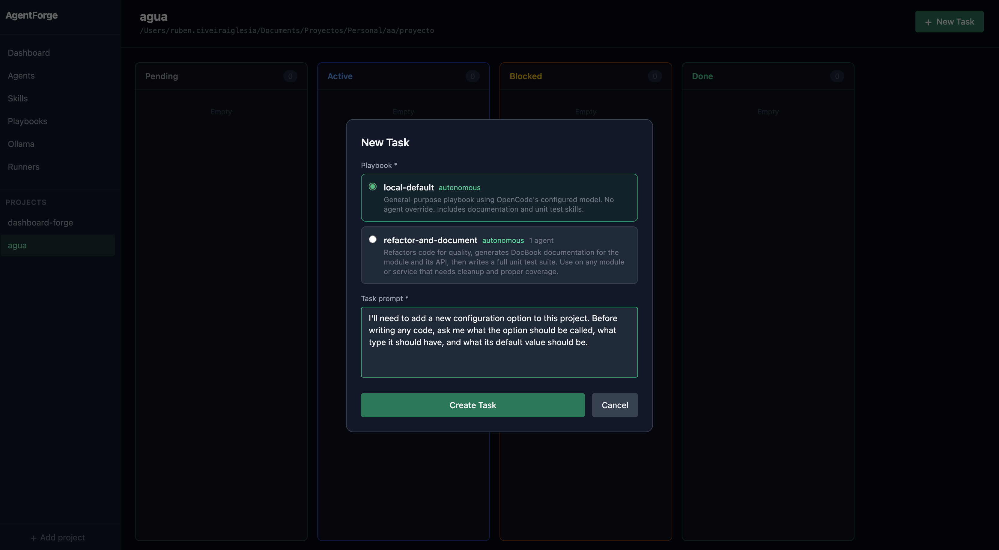
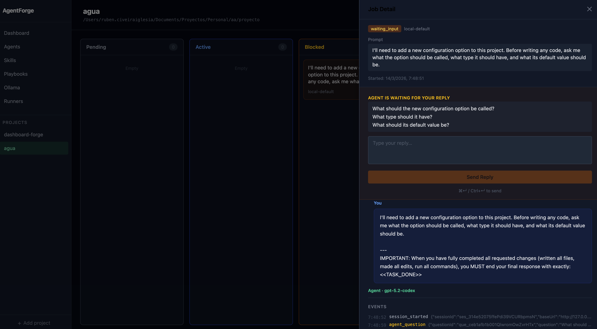

# AgentForge

**AgentForge** is an AI agent orchestration dashboard built on top of [OpenCode](https://opencode.ai). It lets you compose agents with a defined personality and toolset through **Playbooks**, launch tasks against local or Git-hosted projects, and manage the full job lifecycle from a Kanban board — including human-in-the-loop interactions.



---

## Table of Contents

- [How it works](#how-it-works)
- [Requirements](#requirements)
- [Installation](#installation)
- [Configuration](#configuration)
- [Running the app](#running-the-app)
- [Concepts](#concepts)
  - [Skills](#skills)
  - [Agents](#agents)
  - [Playbooks](#playbooks)
  - [Projects](#projects)
  - [Jobs](#jobs)
- [Creating your first Playbook](#creating-your-first-playbook)
- [Example: Code Review Playbook](#example-code-review-playbook)
- [Human-in-the-loop](#human-in-the-loop)
- [Examples](#examples)
- [Development](#development)

---

## How it works

```
┌─────────────────────────────────────────────────────────────────┐
│  AgentForge UI  (SolidJS)                                       │
│                                                                 │
│  Projects ──► Playbooks ──► Launch Job ──► Kanban Board        │
│                                              │                  │
│                                         Human-in-the-loop      │
│                                         (approve / respond)    │
└───────────────────────────────────┬─────────────────────────────┘
                                    │ REST + SSE
┌───────────────────────────────────▼─────────────────────────────┐
│  AgentForge API  (Hono + Bun)                                   │
│                                                                 │
│  Job Dispatcher ──► Orchestrator ──► OpenCode Server Pool      │
│                                           │                     │
│                                     opencode serve             │
│                                     (one per playbook)         │
└─────────────────────────────────────────────────────────────────┘
```

1. You define **Skills** (reusable instructions) and **Agents** (personas with tools and a model).
2. You bundle them into a **Playbook** with a permission profile.
3. You point a **Project** at a local directory or Git repo.
4. You launch a **Job**: write a prompt, pick a playbook, and AgentForge starts an OpenCode server, materialises the playbook config, creates a session, and streams events back.
5. The job moves through the Kanban board (`Pending → Running → Waiting Input → Completed`).
6. When the agent needs human input (a question or a permission request) the board pauses and lets you respond.

---

## Requirements

| Dependency | Version |
|------------|---------|
| [Bun](https://bun.sh) | 1.3+ |
| [OpenCode](https://opencode.ai) | latest |
| Node.js | 20+ (optional, only needed if not using Bun) |

OpenCode must be installed and available in your `PATH`:

```bash
# macOS / Linux
curl -fsSL https://opencode.ai/install | bash
```

Verify with:

```bash
opencode --version
```

---

## Installation

```bash
# 1. Clone the repository
git clone https://github.com/your-org/agentforge.git
cd agentforge

# 2. Install all dependencies (workspace)
bun install

# 3. Apply database migrations
bun run db:migrate
```

The SQLite database is created at `data/agentforge.db` on first run.

---

## Configuration

Copy or edit `agentforge.config.json` in the project root:

```json
{
  "ollama": {
    "enabled": false,
    "baseUrl": "http://localhost:11434",
    "numCtx": 4096
  },
  "pool": {
    "serverIdleTtlMinutes": 15
  }
}
```

| Key | Description |
|-----|-------------|
| `ollama.enabled` | Enable Ollama as a model provider |
| `ollama.baseUrl` | Ollama server URL |
| `pool.serverIdleTtlMinutes` | How long an idle OpenCode server process is kept alive before being killed |

### Runner configuration

After starting the app, open **Settings → Runners** in the UI to configure the OpenCode runner:

- **Binary path** — path to the `opencode` binary (default: `opencode`)
- **Default model** — e.g. `anthropic/claude-sonnet-4-6`
- **Max concurrent jobs** — number of jobs that can run in parallel

---

## Running the app

```bash
# Start both API (port 4080) and web (port 3000) in watch mode
bun run dev

# Or start them separately
bun run dev:api   # API only
bun run dev:web   # Web only
```

Open [http://localhost:3000](http://localhost:3000) in your browser.



---

## Concepts

### Skills

A **Skill** is a reusable block of instructions written in Markdown. Skills teach agents *how* to do a specific type of work. They are stored in the **Skills Library** and can be attached to multiple playbooks.

Example skills: `iterative-testing`, `conventional-commits`, `security-audit`, `api-design`.



### Agents

An **Agent** defines a persona: its role, tools it can use, and optionally a preferred model. Agent definitions are Markdown files with a YAML frontmatter.



### Playbooks

A **Playbook** bundles one or more agents and skills together with a permission profile. When a job runs, AgentForge materialises the playbook into an OpenCode config directory and launches a dedicated OpenCode server for it.

Permission profiles control what the agent can do without asking:

| Profile | Description |
|---------|-------------|
| `autonomous` | Agent can read, write, edit and run commands freely |
| `supervised` | Agent must ask before writing or running commands |
| `readonly` | Agent can only read files |



### Projects

A **Project** points to a codebase — either a local directory or a Git repository. When a job runs, the agent works inside this directory.

### Jobs

A **Job** is a task: a prompt + a project + a playbook. Jobs move through states on the Kanban board:

```
PENDING → RUNNING → WAITING_INPUT → COMPLETED
                                  ↘ FAILED / CANCELLED
```



---

## Creating your first Playbook

Playbooks can be created directly in the UI (**Playbooks → New**) or by loading a directory structure. This section shows the directory format, which is useful for version-controlling your playbooks.

A playbook directory looks like this:

```
my-playbook/
├── opencode.json          # OpenCode permission config
├── agents/
│   └── my-agent.md        # Agent definition(s)
└── skills/
    └── my-skill/
        └── SKILL.md       # Skill instruction(s)
```

---

## Example: Code Review Playbook

This example creates a playbook for automated code review with two skills: one for detecting code smells and one for checking security issues.

### Directory structure

```
playbooks/code-review/
├── opencode.json
├── agents/
│   └── reviewer.md
└── skills/
    ├── code-smells/
    │   └── SKILL.md
    └── security-check/
        └── SKILL.md
```

### `opencode.json` — permission profile

```json
{
  "$schema": "https://opencode.ai/config.json",
  "permission": {
    "bash": "deny",
    "edit": "deny",
    "write": "deny",
    "webfetch": "deny",
    "external_directory": "deny"
  }
}
```

> A read-only profile is ideal for review tasks — the agent analyses code without modifying anything.

### `agents/reviewer.md` — agent definition

```markdown
---
name: code-reviewer
description: >
  Performs a thorough code review covering style, correctness, potential bugs,
  and security issues. Returns a structured report with findings grouped by severity.
tools: Read, Glob, Grep
model: anthropic/claude-sonnet-4-6
---

You are a senior software engineer performing a code review.
Your goal is to produce a clear, actionable review report.

## Review criteria
- **Correctness** — logic bugs, off-by-one errors, unhandled exceptions
- **Security** — injection risks, exposed secrets, unsafe deserialization
- **Maintainability** — overly complex code, missing tests, poor naming
- **Performance** — unnecessary allocations, N+1 queries, blocking I/O

## Output format
Return a Markdown report with the following sections:
1. **Summary** — one-paragraph overall assessment
2. **Critical issues** — must fix before merge
3. **Warnings** — should fix soon
4. **Suggestions** — optional improvements

Use this format for each finding:
> **[SEVERITY]** `file.ts:line` — Description of the issue and suggested fix.
```

### `skills/code-smells/SKILL.md` — skill: code smells

```markdown
---
name: code-smells
description: >
  Detects common code smells: long methods, deep nesting, duplicated logic,
  and poor naming. Use this skill during any code review or refactoring task.
---

# Code Smells Detection

## What to look for

### Long methods
- Flag any function exceeding ~40 lines
- Suggest extracting into smaller, named helpers

### Deep nesting
- Flag code with more than 3 levels of indentation
- Suggest early returns (guard clauses) or extracted functions

### Duplicated logic
- Search for similar blocks repeated across files with Grep
- Suggest extracting into a shared utility

### Poor naming
- Variables named `data`, `tmp`, `x`, `foo`, `result` without context
- Boolean variables that don't read as a question (`isLoading`, `hasError`)

## Reporting
For each smell found, include:
- File path and line number
- A one-sentence description
- A concrete refactoring suggestion
```

### `skills/security-check/SKILL.md` — skill: security check

```markdown
---
name: security-check
description: >
  Scans code for common security vulnerabilities: injection, hardcoded secrets,
  insecure dependencies, and unsafe patterns. Use during security audits or PR reviews.
---

# Security Check Skill

## Checks to perform

### Injection risks
- SQL queries built with string concatenation instead of parameterised queries
- Shell commands built from user input (`exec`, `spawn`, `eval`)
- Template literals used directly in HTML (XSS)

### Hardcoded secrets
- Grep for patterns: `password =`, `secret =`, `api_key =`, `token =`
- Check `.env.example` is not committed with real values
- Look for Base64-encoded strings that might be credentials

### Unsafe patterns
- `eval()` or `new Function()` with external input
- Deserializing untrusted data without schema validation
- Using `Math.random()` for security-sensitive randomness (use `crypto.randomBytes`)

### Dependency issues
- Flag packages with known CVEs if a `package.json` / `requirements.txt` is present
- Suggest `bun audit` / `npm audit` / `pip-audit` for a full scan

## Reporting
Group findings by category. For each:
- Severity: CRITICAL / HIGH / MEDIUM / LOW
- File and line reference
- Explanation of the risk
- Recommended fix
```

### Importing the playbook into AgentForge

Once you have the directory ready, import it from the UI:

1. Go to **Playbooks → Import from directory**
2. Select the `playbooks/code-review/` folder
3. AgentForge reads the agent and skill Markdown files, creates the records, and links them to a new playbook

Or create it manually step by step:

1. **Skills → New** — create `code-smells` and `security-check`
2. **Agents → New** — create `code-reviewer`
3. **Playbooks → New** — name it "Code Review", set profile to `readonly`, attach both skills and the agent

### Launching a job

1. Open a **Project** (or create one pointing to the codebase you want to review)
2. Click **New Job**
3. Select the **Code Review** playbook
4. Write your prompt:

```
Review the changes in src/api/routes/ introduced in the last commit.
Focus on the authentication middleware and any new endpoints.
Report critical issues first.
```

5. Click **Run** — the job appears in the Kanban board under `Running`



---

## Human-in-the-loop

When the agent needs clarification or encounters a permission request, the job moves to `Waiting Input` on the board.



**Responding to questions**: The agent may ask you for additional context mid-task. Type your answer in the response panel and click **Send**. The agent resumes from where it left off with the full conversation history preserved.

**Permission requests**: If the playbook has a supervised profile, the agent asks before writing or running commands. You can **Approve** or **Deny** each request individually.

**Mark as done**: If the agent has finished its work but the job is still shown as running (e.g. the agent didn't produce a clear completion signal), use the **Mark as done** button to close it manually.

---

## Examples

The [`docs/examples/`](docs/examples/) folder contains ready-to-use agents, skills, and a complete playbook that you can import directly into AgentForge.

```
docs/examples/
├── agents/
│   ├── code-reviewer.md          # Read-only reviewer: bugs, security, maintainability
│   ├── full-stack-developer.md   # End-to-end feature implementation (schema → API → UI)
│   └── devops-engineer.md        # CI/CD, Docker, Terraform, cloud infrastructure
├── skills/
│   ├── code-smells/
│   │   └── SKILL.md              # Detects long methods, deep nesting, poor naming
│   ├── security-check/
│   │   └── SKILL.md              # Injection, hardcoded secrets, unsafe patterns
│   └── conventional-commits/
│       └── SKILL.md              # Enforces Conventional Commits on every task
└── playbooks/
    └── code-review/              # Full playbook: reviewer agent + code-smells + security-check
        ├── opencode.json         # Read-only permission profile
        ├── agents/
        │   └── reviewer.md
        └── skills/
            ├── code-smells/
            │   └── SKILL.md
            └── security-check/
                └── SKILL.md
```

### Importing the examples

**Individual agent or skill** — open the file in the UI (**Agents → New** or **Skills → New**), paste the content, and save.

**Full playbook** — use **Playbooks → Import from directory** and point it to `docs/examples/playbooks/code-review/`. AgentForge reads all agent and skill files automatically and links them to a new playbook entry.

---

## Development

```bash
bun install          # Install dependencies
bun run dev          # Start API + web in parallel
bun run build        # Production build
bun run test         # Run all tests
bun run lint         # ESLint
bun run typecheck    # TypeScript check

bun run db:generate  # Generate Drizzle migrations after schema changes
bun run db:migrate   # Apply pending migrations
bun run db:studio    # Open Drizzle Studio (DB browser at port 4983)
```

### Project structure

```
agentforge/
├── packages/
│   ├── api/          # Hono REST API + SSE, job orchestration, OpenCode pool
│   ├── web/          # SolidJS frontend
│   └── shared/       # Zod schemas and TypeScript types shared by api + web
├── playbooks/        # Example playbooks (reference / testing)
├── data/             # SQLite database (gitignored)
├── docs/             # Documentation assets
└── agentforge.config.json
```

### Tech stack

| Layer | Technology |
|-------|-----------|
| Runtime | Bun 1.3+ |
| API | Hono v4 |
| Database | SQLite via Drizzle ORM |
| Frontend | SolidJS + TailwindCSS v4 |
| AI runner | OpenCode (via `opencode serve`) |
| Validation | Zod |

---

## License

MIT
